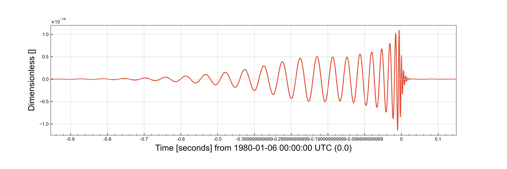
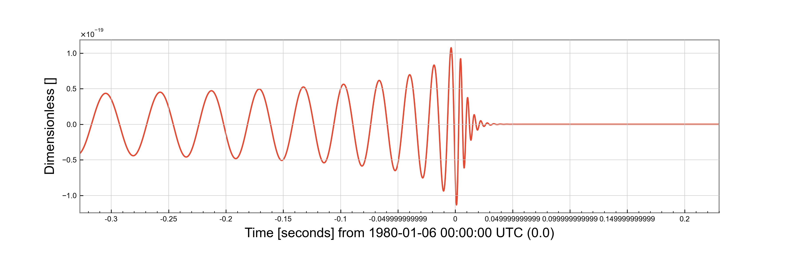

Compact Binary Waveforms
========================

Compact binary coalescences are the sources which have produced all of the gravitational wave detections to the end of 2023.
Minke provides a way of producing waveforms from the various models which are supported by the ``lalsimulation`` library.

Binary Black Holes
------------------

IMRPhenomPv2
^^^^^^^^^^^^

IMRPhenomPv2 is a precessing, spinning black hole model.

::

   import minke
   import astropy.units as u

   from minke.models.cbc import IMRPhenomPv2
   from minke.detector import AdvancedLIGOHanford

   model = IMRPhenomPv2()

   parameters = {"mass_ratio": 0.7, "total_mass": 100*u.solMass, "luminosity_distance": 10*u.megaparsec}

   data = model.time_domain(parameters)

   data = model.time_domain(mass_ratio=0.7, total_mass=100*u.solMass)

   f = data['plus'].plot()
   f.savefig("waveform.png")

	   
SEOBNRv3
^^^^^^^^

::

   import minke
   import astropy.units as u

   from minke.models.cbc import SEOBNRv3
   from minke.detector import AdvancedLIGOHanford

   model = SEOBNRv3()

   parameters = {"mass_ratio": 0.7, "total_mass": 100*u.solMass, "luminosity_distance": 10*u.megaparsec}

   data = model.time_domain(parameters)

   data = model.time_domain(mass_ratio=0.7, total_mass=100*u.solMass)

   f = data['plus'].plot()
   f.savefig("waveform.png")

