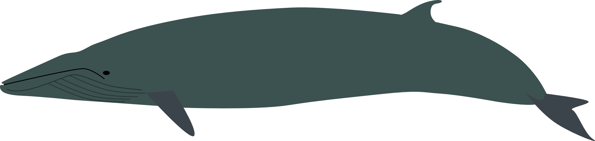

.. minke documentation master file, created by
   sphinx-quickstart on Tue Jul  9 22:26:36 2013.
   You can adapt this file completely to your liking, but it should at least
   contain the root `toctree` directive.

Minke
=====

Minke is a pipeline to produce Burst Mock Data Challenges for the LIGO
Scientific Collaboration. It is capable of producing ad-hoc and
numerical relativity burst injections.

Minke is designed to simplify the production processes for MDCs, and
to facilitate the automated production of injection frames during
observing runs.

In order to run Minke you'll need to have LALSuite installed, and at
the moment you'll need to have the `simburst-rel` branch of it
installed specifically, so that you can make supernova (and other
numerical relativity) injections.

If you're looking to make MDC injection sets for a burst analysis, but
you aren't concerned with contributing new code take a look at the
User Guide. If you need a feature which isn't currently implemented
then please have a look at the "Contributing" section of the Developer
Guide.

The Minke framework aims to be flexible, and easily extended to
include new waveform morphologies, and signal distributions, so if you
find something lacking feel free to make a pull request!

User Guide
==========

.. toctree::
   :maxdepth: 2

   
   installation
   tutorial
   tutorial-editing
   usage

Developer Guide
===============

.. toctree::
   :maxdepth: 2

   contributing

Credits and Information
=======================

.. toctree::
   :maxdepth: 2
	   
   authors
   history

Indices and tables
==================

* :ref:`genindex`
* :ref:`modindex`
* :ref:`search`

