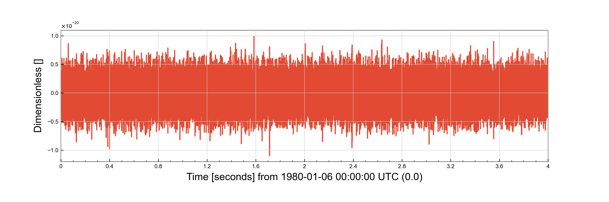

Noise sources
=============

An important part of preparing injections with Minke is being able to add them to a known noise background.

Minke interfaces with the ``lalsimulation`` noise sources to simulate noise for a variety of detectors and design scenarios.

::

   from minke.noise import AdvancedLIGO

   noise = AdvancedLIGO()

   data = noise.time_series(duration=4, sample_rate=16384)

   f = data.plot()
   f.savefig("noise.png")

