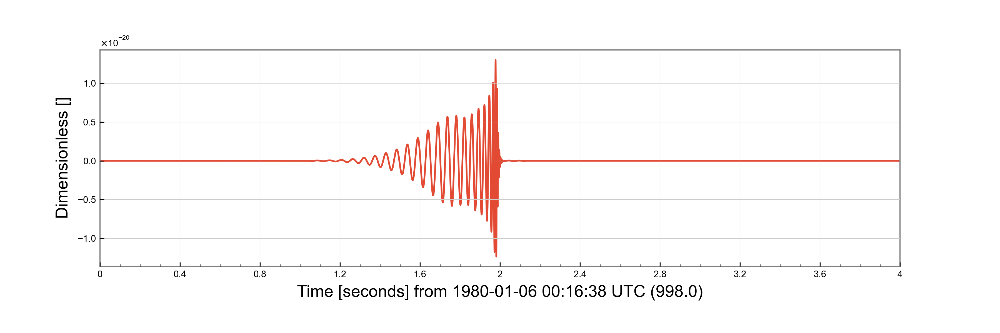

Injection frames
================

Minke is able to create frame files which contain injections, which can then be used to do things like characterising parameter estimation algorithms.

It is possible to do this by writing a script.
However, Minke also provides a function to do this, and a commandline interface.
It is also possible to produce injection frames as a step in an asimov workflow.

Script
^^^^^^

.. plot::
   :include-source:

   from minke.noise import AdvancedLIGO
   import astropy.units as u
   from minke.models.cbc import IMRPhenomPv2
   from minke.detector import AdvancedLIGOHanford

   noise = AdvancedLIGO()
   noise_ts = noise.time_series(duration=4, sample_rate=16384, epoch=998)

   model = IMRPhenomPv2()
   parameters = {"mass_ratio": 0.7, "total_mass": 100*u.solMass, 
                 "luminosity_distance": 100*u.megaparsec, "gpstime": 1000}

   data = model.time_domain(parameters, times=noise_ts.times)
   
   detector = AdvancedLIGOHanford()
   projected = data.project(detector,
                ra=1, dec=0.5,
                iota=0.4,
                phi_0=0,
                psi=0
                )
   injection = (noise_ts + projected)
   fig = injection.plot()
   plt.tight_layout()

   # Can save to frame file:
   # injection.write("test_injection.gwf", format="gwf")

The `make_injections` Functions
^^^^^^^^^^^^^^^^^^^^^^^^^^^^^^^

.. plot::
   :include-source:

   from minke.injection import make_injection
   import astropy.units as u

   detectors = {"AdvancedLIGOHanford": "AdvancedLIGO"}

   parameters = {"mass_ratio": 0.7,
                 "total_mass": 100*u.solMass,
                 "luminosity_distance": 100*u.megaparsec,
                 "ra": 1,
                 "dec": 0.5,
                 "iota": 0.4,
                 "phi_0": 0,
                 "psi": 0,
                 "gpstime": 1000}

   injection = make_injection(detectors=detectors, 
                             injection_parameters=parameters, 
                             duration=4, sample_rate=4096, epoch=998)['H1']

   fig = injection.plot()
   plt.tight_layout()

SNR-Based Injections
^^^^^^^^^^^^^^^^^^^^

Instead of specifying a luminosity distance, you can specify a target network signal-to-noise ratio (SNR).
Minke will automatically calculate the required luminosity distance to achieve that SNR across all detectors.

.. plot::
   :include-source:

   from minke.injection import make_injection
   import astropy.units as u

   detectors = {"AdvancedLIGOHanford": "AdvancedLIGO", 
                "AdvancedLIGOLivingston": "AdvancedLIGO"}

   parameters = {"m1": 30,
                 "m2": 30,
                 "snr": 20,  # Specify SNR instead of luminosity_distance
                 "ra": 0,
                 "dec": 0.5,
                 "theta_jn": 0.4,
                 "phase": 0,
                 "psi": 0}

   injections = make_injection(detectors=detectors, 
                                injection_parameters=parameters, 
                                duration=4, sample_rate=4096, epoch=998)

   # The network SNR will be approximately 20
   # Individual detector SNRs will depend on antenna patterns
   for det_name, injection in injections.items():
       print(f"{det_name}: SNR calculated from distance")

.. note::
   When using SNR-based injection, the ``snr`` parameter should be provided instead of ``luminosity_distance``.
   The network SNR is calculated as the quadrature sum of individual detector SNRs:
   
   .. math::
      \text{SNR}_{\text{network}} = \sqrt{\sum_i \text{SNR}_i^2}
   
   Minke uses a root-finding algorithm to determine the luminosity distance that produces the target network SNR.

We can also produce injections into zero noise:

::

   from minke.injection import make_injection_zero_noise
   from minke.noise import AdvancedLIGO
   from minke.models.cbc import IMRPhenomPv2
   from minke.detector import AdvancedLIGOHanford

   import astropy.units as u

   detectors = {"AdvancedLIGOHanford": "AdvancedLIGO"}

   parameters = {"mass_ratio": 0.7,
		 "total_mass": 100*u.solMass,
		 "luminosity_distance": 100*u.megaparsec,
		 "ra": 1,
		 "dec": 0.5,
		 "iota": 0.4,
		 "phi_0": 0,
		 "psi": 0,
		 "gpstime": 1000}

   injection = make_injection_zero_noise(detectors=detectors, injection_parameters=parameters, duration=4, sample_rate=16384, epoch=998)['H1']

   f = injection.plot()
   f.savefig("injection_function_zero.png")

	   
The Command-line interface
^^^^^^^^^^^^^^^^^^^^^^^^^^

To use the command line interface you'll need to create a YAML-formatted configuration file.

For example, using luminosity distance::
  
   injection:
     duration: 4
     sample_rate: 4096
     epoch: 998
     channel: Injection
     parameters:
       luminosity_distance: 400
       m1: 35
       m2: 30
     waveform: IMRPhenomPv2
     interferometers:
       H1: AdvancedLIGOHanford
       L1: AdvancedLIGOLivingston
     psds:
       H1: AdvancedLIGO
       L1: AdvancedLIGO

Alternatively, you can specify a target network SNR instead of luminosity distance::

   injection:
     duration: 4
     sample_rate: 4096
     epoch: 998
     channel: Injection
     parameters:
       snr: 20  # Target network SNR
       m1: 35
       m2: 30
       ra: 0
       dec: 0
       psi: 0
       theta_jn: 0
       phase: 0
     waveform: IMRPhenomPv2
     interferometers:
       H1: AdvancedLIGOHanford
       L1: AdvancedLIGOLivingston
     psds:
       H1: AdvancedLIGO
       L1: AdvancedLIGO

Save this file as ``settings.yml``.
You can then create the injection files by running ``minke injection --settings settings.yml``       

As a step in an asimov workflow
^^^^^^^^^^^^^^^^^^^^^^^^^^^^^^^
  
